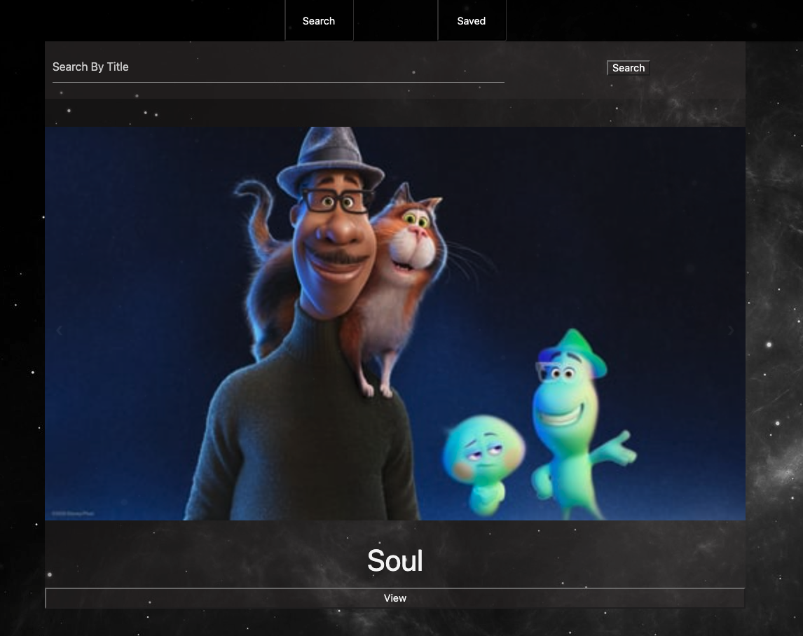
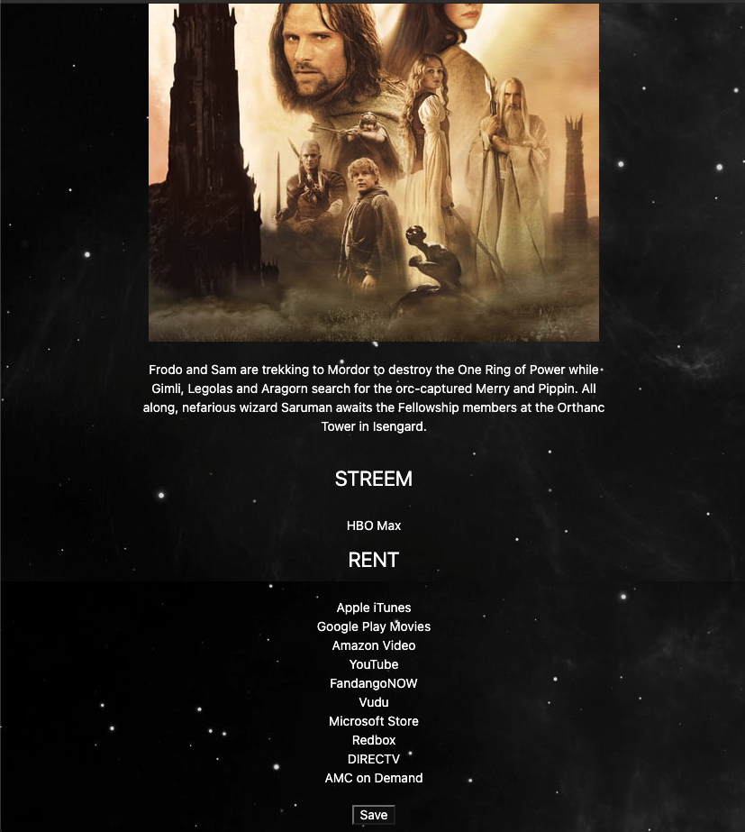

  # MovieSearch

  </img>

  </img>

  

  ## Description

  A simple full stack app utilizing The Movie Database API. On the home page, a carousel displays trending movies for the day and you may search any movie you would like.

  ## Images

  
  ## Table of Content

  * [Installation](#installation)

  * [Usage](#usage)

  * [License](#license)

  * [Contributing](#contributors)

  * [Contact](#questions/contact)

  ## Installation

  To Install necessary dependencies, run the following command:
  
  npm install express mongojs mongoose

  ## Usage

  You may search for any movie you would like by title. Once you hit search/return, you will find the search results and can scroll through them and view any one you would like. Once you view a movie, you will be provided with the streaming or renting locations available. You may also save the movie to a database for future reference. If you go to the saved page, you will see your saved movies and you can delete any movie in your saved page that you would like.
  
  ## Technologies

      The technologies used are JavaScrypt, CSS, HTML, Node.js, express, mongojs, mongoose, and The Movie Database API.

  ## Contributors

  Ben Hopkins

  ## Questions/Contact

  <a href="https://github.com/bh007183">GitHub Profile</a>
  <a href="mailto:bjhops17@gmail.com"> Email Me</a>
  
  

  